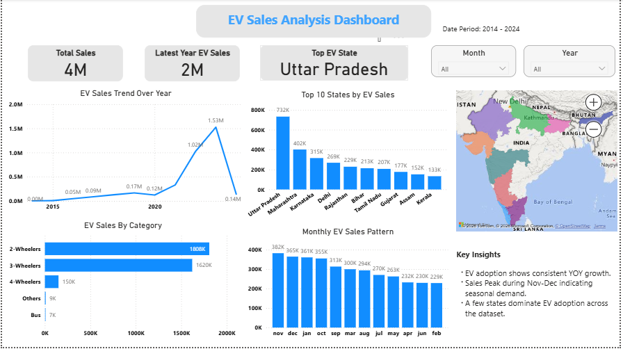

# EV Sales Analysis 🚗⚡

## Project Overview

This project analyzes Electric Vehicle (EV) sales data to identify trends in adoption across different years, states, vehicle categories, and months.
The goal is to uncover key insights about EV market growth and present them through clear visualizations and a business-focused dashboard.

---

## Objectives

* Analyze EV sales trends over time.
* Identify the top-performing states in EV adoption.
* Understand which vehicle categories dominate the EV market.
* Discover seasonal sales patterns.
* Present insights through an interactive dashboard.

---

## Tools & Technologies

* **SQL (PostgreSQL)** – Data analysis and aggregations
* **Python** – Data analysis and visualization
* **Pandas** – Data manipulation
* **Matplotlib & Seaborn** – Data visualization
* **Power BI** – Interactive dashboard creation

---

## Project Workflow

Raw Dataset
→ Data Cleaning (Python)
→ Data Analysis & Aggregations (SQL)
→ Visualization (Python)
→ Interactive Dashboard (Power BI)

---

## Key Insights

* EV adoption shows consistent **year-over-year growth** across the dataset.
* **November and December** record the highest sales, indicating seasonal demand.
* EV adoption is concentrated in a **few leading states**.
* **Two-wheelers dominate** the EV market compared to other categories.

---

## Dashboard

The Power BI dashboard provides a clear overview of EV adoption patterns including:

* Total EV sales
* Latest year EV sales
* Top EV adoption state
* EV sales trends over time
* Category-wise EV distribution
* Monthly sales patterns

---

## Future Improvements

* Add more advanced statistical analysis.
* Include predictive modeling for EV sales forecasting.
* Expand dashboard with additional regional insights.
